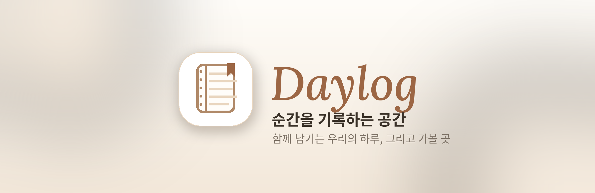
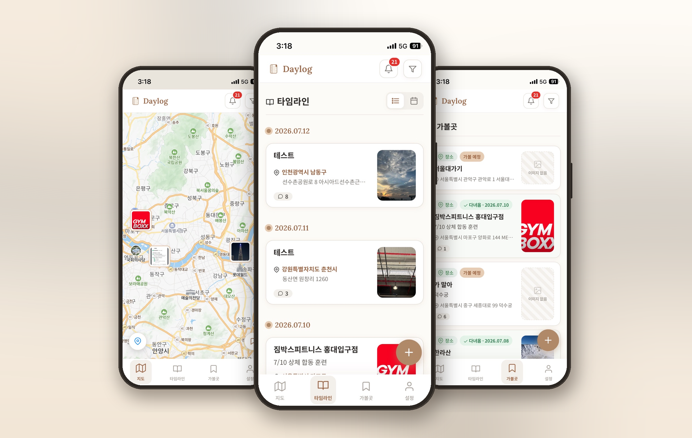
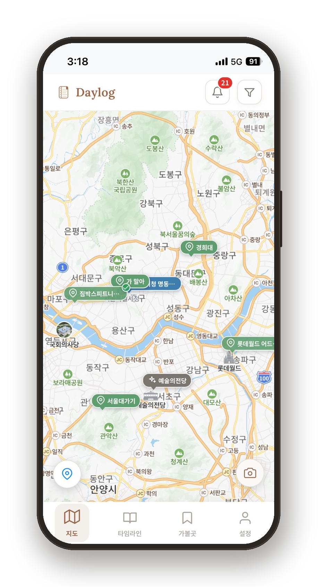
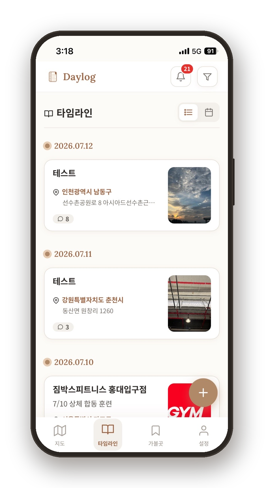
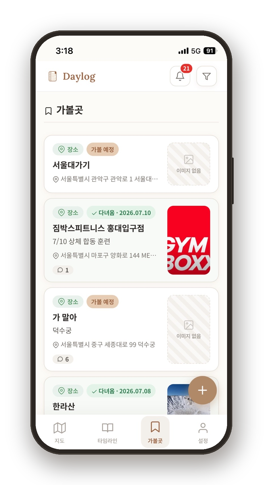
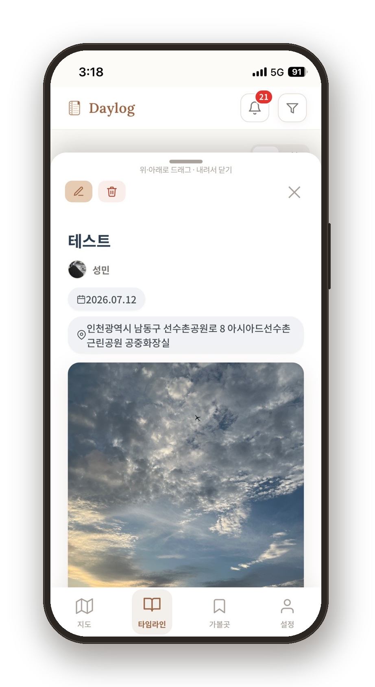
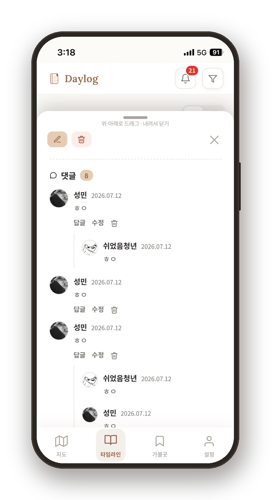
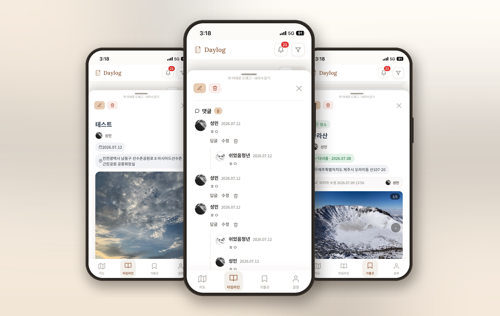

  

**소중한 사람들과 함께, 우리의 하루와 가볼 곳을 지도 위에 남기는 기록 공간**

 

 

## Daylog은 이런 앱이에요

여행지에서 찍은 사진, 오늘 다녀온 카페, 언젠가 꼭 가보고 싶은 곳.
그냥 흘려보내기 아까운 순간들을 **지도 위 한 장의 카드**로 남겨두는 앱이에요.

혼자만의 다이어리가 아니라, **커플 · 친구 · 가족 · 지인과 같은 공간(방)** 을 만들어
서로의 기록에 댓글을 달고, 함께 갈 곳을 모아두며 추억을 쌓아갈 수 있어요.

 

## 이런 걸 할 수 있어요

<table>
<tr>
<td width="58%" valign="middle">

### 🗺 지도에서 한눈에

기록한 추억과 가보고 싶은 곳이 **실제 위치에 핀**으로 표시돼요.
사진 핀과 장소 핀을 지도 위에서 바로 확인하고, 현재 위치로 이동하거나
원하는 종류만 골라보는 필터도 쓸 수 있어요.
지도 화면에서 카메라 버튼으로 **그 자리에서 바로 새 기록**을 남길 수도 있답니다.

</td>
<td width="42%" align="center">

</td>
</tr>

<tr>
<td width="42%" align="center">

</td>
<td width="58%" valign="middle">

### 📖 타임라인으로 차곡차곡

남긴 기록이 **날짜별로 쌓이는 타임라인**이에요.
리스트 보기와 달력 보기를 자유롭게 오갈 수 있고,
카드마다 장소 · 사진 · 댓글 수가 한눈에 들어와요.
지난 날의 하루를 다시 넘겨보기 좋아요.

</td>
</tr>

<tr>
<td width="58%" valign="middle">

### 🔖 가볼곳 위시리스트

“여기 언젠가 꼭 가보자” 하는 곳을 미리 저장해두세요.
아직 안 갔으면 **가볼 예정**, 다녀왔으면 날짜와 함께 **다녀옴**으로 체크돼요.
장소 · 식당 · 카페처럼 종류별로 정리할 수 있어서
다음 약속 장소를 고를 때 딱이에요.

</td>
<td width="42%" align="center">

</td>
</tr>

<tr>
<td width="42%" align="center">

</td>
<td width="58%" valign="middle">

### 📝 사진과 함께 자세히

하나의 기록에는 **제목 · 내용 · 날짜 · 위치**를 담고,
사진은 **최대 10장**까지. 꾹 눌러 순서를 바꾸고, 자르기 · 회전으로
마음에 드는 컷만 골라 담을 수 있어요.
누가 언제 남겼는지도 함께 표시돼요.

</td>
</tr>
</table>

 

### 💬 댓글과 답글로 함께 반응

각 기록마다 **댓글과 답글(대댓글)** 을 남길 수 있어요.
친구의 사진에 한마디 남기고, 서로 이야기를 이어가는 재미가 있죠.
내가 쓴 댓글은 언제든 **수정 · 삭제**할 수 있어요.

### 🔔 놓치지 않는 알림

새 댓글 · 답글, 방 입장 요청과 수락 같은 소식을
**실시간 알림**으로 바로 받아볼 수 있어요.
상단의 종 아이콘을 누르면 지난 알림을 모아둔 **알림함**이 열리고,
안 읽은 소식은 빨간 배지로 표시돼요.

 

### 👥 함께하는 우리만의 방

혼자가 아니라 **함께** 기록하는 게 Daylog의 핵심이에요.

- **관계에 맞는 방** — 커플 · 친구 · 가족 · 지인 · 개인 중에서 골라 만들기
- **초대와 입장** — 방 코드로 초대하고, 입장 요청 · 수락으로 안전하게 합류
- **기념일 D-Day** — 함께한 날부터 며칠째인지 방에서 확인
- **분리된 공간** — 방마다 기록이 따로 담겨, 관계별로 깔끔하게 정리돼요

 

## 시작하는 방법

1. **간편 로그인** — 카카오 · 네이버 · 구글 계정으로 몇 초 만에 시작
2. **닉네임 설정** — 방에서 보일 내 이름 정하기
3. **방 만들기 / 입장** — 새 방을 만들거나, 받은 코드로 함께할 방에 입장
4. **첫 기록 남기기** — 사진 한 장, 장소 하나부터 가볍게 시작해요

 

## 📱 앱처럼 설치해서 쓰기

Daylog은 **PWA**라서 앱스토어에서 내려받지 않아도,
웹 주소에 접속한 뒤 홈 화면에 추가하면 **일반 앱처럼** 쓸 수 있어요.
설치하면 전체 화면으로 실행되고, 푸시 알림도 받을 수 있어요.

> 접속 주소 : **`https://<여기에-Daylog-주소>`**

<table>
<tr>
<td width="50%" valign="top">

### 🍎 iPhone · iPad (Safari)

1. **Safari**로 Daylog에 접속해요
2. 하단 가운데 **공유 버튼**( ⬆️ 네모+화살표 )을 눌러요
3. 메뉴에서 **‘홈 화면에 추가’** 선택
4. 오른쪽 위 **‘추가’** 를 누르면 끝!
5. 홈 화면의 **Daylog 아이콘**으로 실행

> 알림을 켜려면 홈 화면에서 앱을 연 뒤,
> 안내창의 **‘허용하기’** 를 눌러주세요. *(iOS 16.4 이상)*

</td>
<td width="50%" valign="top">

### 🤖 Android (Chrome)

1. **Chrome**으로 Daylog에 접속해요
2. 우측 상단 **⋮ 메뉴**를 눌러요
3. **‘앱 설치’** 또는 **‘홈 화면에 추가’** 선택
4. **‘설치’** 를 누르면 끝!
5. 앱 서랍 / 홈 화면의 **Daylog 아이콘**으로 실행

> 설치하면 일반 앱처럼 실행되고,
> 새 소식 **푸시 알림**도 바로 받을 수 있어요.

</td>
</tr>
</table>

 

## 한 걸음 더

 

**Daylog** — 순간을 기록하는 공간

소중한 사람들과 함께 남기는 추억

